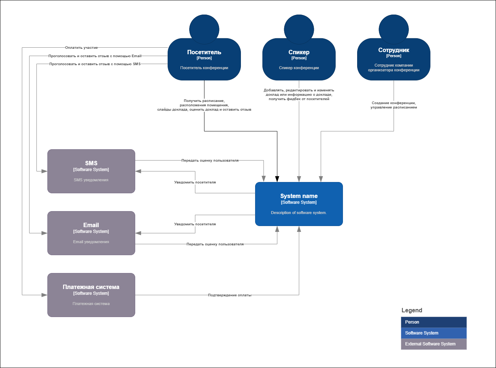

# Решение

## Содержание

* [Бизнес контекст](#бизнес-контекст)
* [Бизнес-цели и бизнес-драйверы](#бизнес-цели-и-бизнес-драйверы)
* [Стекхолдеров и их потребности](#стекхолдеров-и-их-потребности)
* [Пользовательские истории](#пользовательские-истории)
* [Атрибуты качества](#атрибуты-качества)
* [Контекстная схема системы](#контекстная-схема-системы)
* [Критические характеристики](#критические-характеристики)

## Бизнес-контекст

Компании занимается организацией конференций на всей территории США. Конференции посещают тысячи слушателей, которые слушаю доклады сотни спикеров. Каждая конференция брендируется в зависимости от темы.

## Бизнес-цели и бизнес-драйверы

**Бизнес-цели:**

Разработать систему управления конференциями, которая поможет посетителям и спикерам, а так же сотрудникам компании участвующих в организации конференций и удовлетворит потребности каждого участника процесса. Тем самым можно рассчитывать на положительные отзывы и лояльность посетителей и спикеров, и на по повторное участие их в следующих конференциях. Это поможет росту доверия к компании и увеличения числа посетителей будущих конференций благодаря положительному опыту участников на прошедших конференциях.  

**Бизнес-драйверы:**

* Удобство участия в конференции спикеров и посетителей
* Простота управлением конференции и брендирования ее сотрудниками компании

## Стекхолдеров и их потребности

Основные стекхолдеры:

* Сотрудники компании:
  * Создание конференции в системе
  * Управление расписанием
  * Брендирование страницы конференции
* Спикеры
  * Управление информацией о докладе
* Посетители
  * Получение расписания докладов и места выступления
  * Получение доступа к слайдам доклада
  * Получение уведомлений об изменение в расписание
  * Возможность оценить доклад удобным для посетителя способом (сайт, sms, email)
  * Оплатить участие в конференции

## Пользовательские истории

## Атрибуты качества

## Контекстная схема системы

Ниже представлена контекстная диаграмма разрабатываемого решения:  

## Критические характеристики
