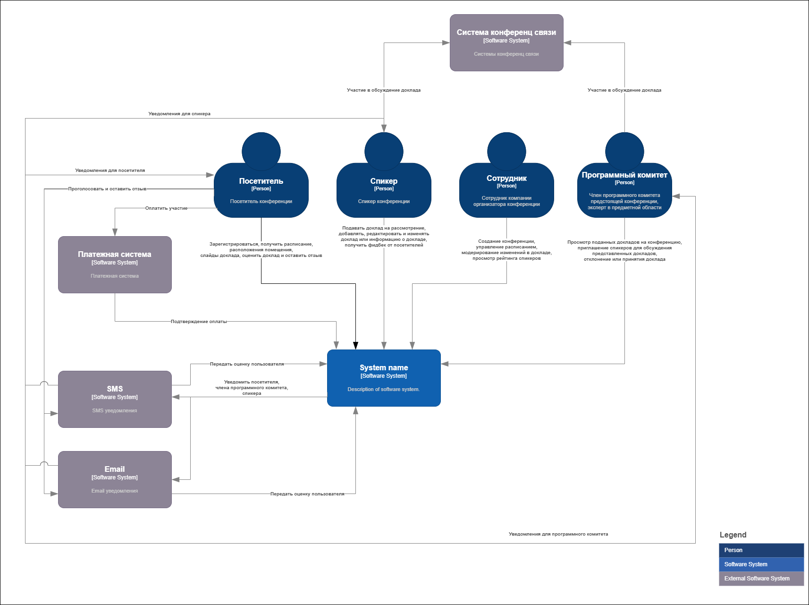

# Решение

## Содержание

* [Бизнес контекст](#бизнес-контекст)
* [Бизнес-цели и бизнес-драйверы](#бизнес-цели-и-бизнес-драйверы)
* [Стекхолдеров и их потребности](#стекхолдеров-и-их-потребности)
* [Пользовательские истории](#пользовательские-истории)
* [Атрибуты качества](#атрибуты-качества)
* [Контекстная схема системы](#контекстная-схема-системы)
* [Критические характеристики](#критические-характеристики)

## Бизнес-контекст

Компании занимается организацией конференций на всей территории США. Конференции посещают тысячи слушателей, которые слушаю доклады сотни спикеров. Каждая конференция брендируется в зависимости от темы.

## Бизнес-цели и бизнес-драйверы

**Бизнес-цели:**

Разработать систему управления конференциями, которая поможет посетителям и спикерам, а так же сотрудникам компании участвующих в организации конференций и удовлетворит потребности каждого участника процесса. Тем самым можно рассчитывать на положительные отзывы и лояльность посетителей и спикеров, и на по повторное участие их в следующих конференциях. Это поможет росту доверия к компании и увеличения числа посетителей будущих конференций благодаря положительному опыту участников на прошедших конференциях.  

**Бизнес-драйверы:**

* Удобство участия в конференции спикеров и посетителей
* Простота управлением конференции и брендирования ее сотрудниками компании

## Стекхолдеров и их потребности

Основные стекхолдеры:

* Сотрудники компании
  * Создание конференции в системе
  * Управление расписанием
  * Брендирование страницы конференции
  * Модерация информации о докладе
* Спикеры
  * Подача заявки на выступление
  * Управление информацией о докладе
  * Просмотр оценок и отзывов от пользователей
* Программный комитет
  * Рассмотрение докладов и включение их в конференцию
* Посетители
  * Получение расписания докладов и места выступления
  * Получение доступа к слайдам доклада
  * Получение уведомлений об изменение в расписание
  * Возможность оценить доклад удобным для посетителя способом (сайт, sms, email)
  * Оплатить участие в конференции

## Пользовательские истории

**Посетитель конференции:**

* Как посетитель конференции, я хочу иметь возможность зарегистрировать в системе, для получения доступа к функционалу системы.  
* Как посетитель конференции, я хочу иметь возможность купить билет на конференцию, для возможности посетить ее.  
* Как посетитель конференции, я хочу иметь возможность просматривать расписание конференции, для выбора интересующего меня доклада.  
* Как посетитель конференции, я хочу иметь возможность просматривать расположения места проведения доклада, чтобы заранее знать в какой стороне находится интересующий меня доклад.  
* Как посетитель конференции, я хочу иметь возможность скачивать слайды доклада, для удобного ознакомления с их содержимым.  
* Как посетитель конференции, я хочу иметь возможность оценить прослушанный доклад и оставить отзыв, для того чтобы помочь спикеру с улучшением его доклада.  
* Как посетитель конференции, я хочу иметь возможность получать уведомления, удобным для меня способом (SMS или Email), об изменениях в расписание конференции, чтобы вовремя среагировать и выбрать другой доклад для участия.  

**Спикер:**

* Как спикер конференции, я хочу иметь возможность подать доклад на рассмотрение программному комитету, для участия в конференции.  
* Как спикер конференции, я хочу получать уведомления о назначенных встречах с программным комитетом, чтобы не пропустить ее.  
* Как спикер конференции, я хочу иметь возможность вносить изменения в название или описания доклада.  
* Как спикер конференции, я хочу иметь возможность заранее ознакомиться со временем и местом моего выступления, для того что бы подготовиться к нему.  
* Как спикер конференции, я хочу иметь возможность видеть оценку моего доклада и отзывы от посетителей, чтобы иметь возможность улучшить свой доклад и навыки выступления.  

**Программный комитет:**

* Как представитель программного комитета, я хочу иметь возможность просматривать заявки докладов, для возможности оценить соответствуют ли они теме конференции.  
* Как представитель программного комитета, я хочу иметь возможность назначать встречу спикерам, для более детально изучения предлагаемого доклада.  
* Как представитель программного комитета, я хочу иметь возможность получать уведомления об предстоящем обсуждением поданных заявок, чтобы не пропустить данную встречу.  
* Как представитель программного комитета, я хочу иметь возможность получать уведомления об предстоящей онлайн встречи со спикером, чтобы не пропустить данную встречу.  
* Как представитель программного комитета, я хочу иметь возможность утверждать доклады и выбирать им тематику, чтобы облегчить организаторам распределять доклады по потокам.  

**Сотрудник компании (организатор):**

* Как организатор конференции, я хочу иметь возможность создавать новые конференции в системе.
* Как организатор конференции, я хочу иметь возможность изменять внешний вид страниц конференции в системе, чтобы брендировать их под спонсоров.  
* Как организатор конференции, я хочу иметь возможность составлять план и график конференции, чтобы у посетителей конференции была информация о времени и месте выступления спикера.
* Как организатор конференции, я хочу иметь возможность модерировать вносимые спикером изменения в информацию о докладе, для помощи спикеру.  
* Как организатор конференции, я хочу иметь возможность вносить изменения в существующий график конференции, чтобы иметь возможность реагировать на возникающие проблемы.  
* Как организатор конференции, я хочу иметь возможность просматривать рейтинг спикеров полученный на основе отзывов с прошлых конференции, чтобы улучшить показатель удержания интереса до конца конференции.  

## Атрибуты качества

Для разрабатываемой системы можно выделить следующие атрибуты качества:  

* Доступность (availability). Система должна оставаться доступной для тысячи пользователей во время проведения конференции. Tо есть должна уметь справляться с наплывом пользователей желающих посмотреть расписание или оставить отзыв во время проведения конференции. Отклик системы должен быть *≤1с*.
* Удобство использования (usability). Система должна быть удобна в использование посетителями, спикерами и сотрудниками участвующих в организации конференции. У пользователей  данной системы не должно быть проблем с поискам интересующей информации или функционала системы.  
* Модифицируемость (modifiability). В системе должен быть предусмотрен функционал, позволяющий сотрудникам компании занимающимися подготовкой конференции, брендировать внешний вид страниц конференции на сайте.  

## Контекстная схема системы

Ниже представлена контекстная диаграмма разрабатываемого решения:  

## Критические характеристики
